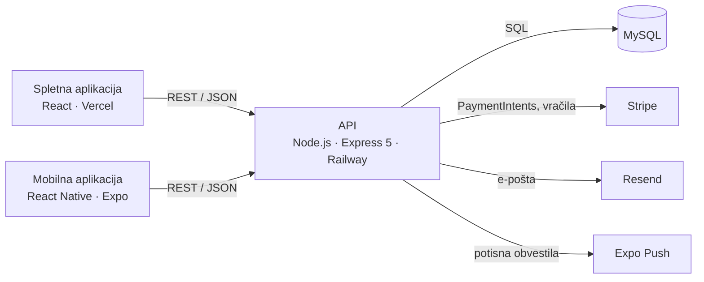

# KinoPlex – API

[](https://github.com/Horvatium/cinema-api/actions/workflows/ci.yml)

REST API za **KinoPlex**, sistem za rezervacijo kinovstopnic: pregled sporeda, izbira sedežev
na zemljevidu dvorane, spletno plačilo s Stripom in upravljanje kinematografa za skrbnike.
Uporabljata ga spletna aplikacija v Reactu in mobilna aplikacija v React Native. Projekt je
nastal kot diplomska naloga in deluje v produkciji.

**Spletna stran:** [kinoplex.si](https://www.kinoplex.si) ·
**Spletna aplikacija:** [cinema-web](https://github.com/Horvatium/cinema-web) ·
**Mobilna aplikacija:** [cinema-mobile](https://github.com/Horvatium/cinema-mobile) ·
[English version](README.en.md)


## Poudarki

- **Plačila z zadržanjem sedežev.** Ob začetku plačila so sedeži 10 minut zadržani kot
  rezervacija v stanju `pending`, ustvari se Stripe PaymentIntent, rezervacija pa se potrdi
  šele, ko strežnik plačilo preveri pri Stripu. Če so sedeži medtem izgubljeni, se denar
  samodejno vrne.
- **Stripe webhook z idempotentno potrditvijo.** Rezervacijo potrdi Stripov dogodek
  `payment_intent.succeeded` s preverjenim podpisom, tudi če stranka po plačilu zapre brskalnik.
  Webhook in klic iz brskalnika lahko prideta hkrati; zaklepi in ključ idempotentnosti pri
  vračilu zagotovijo, da se rezervacija potrdi in denar vrne največ enkrat.
- **Brez dvojnih rezervacij pri sočasnih zahtevkih.** Napako je razkril test, ki za isti
  sedež pošlje več zahtevkov hkrati, popravljena pa je z zaklepanjem vrstic. Glej
  [spodaj](#napaka-z-dvojno-rezervacijo).
- **Integracijski testi proti pravi bazi MySQL**, ne proti nadomestkom: 121 testov z Jestom in
  Supertestom, ki v CI tečejo proti MySQL 8.4.
- **Varnost in validacija:** seja spletne aplikacije v piškotku httpOnly z zaščito pred CSRF,
  varnostne glave (helmet), CORS omejen na spletno stran, omejitev poskusov prijave in
  registracije ter validacija vseh vhodnih podatkov z zod.
- **Dokumentacija na [`/api/docs`](https://api.kinoplex.si/api/docs/)**
  (OpenAPI 3.1, Swagger UI), strukturirano beleženje s pino in pot `/health` za preverjanje
  delovanja.
- **Lokalni zagon z enim ukazom** z Docker Compose, skupaj z bazo in demo podatki.
- **CI/CD** z GitHub Actions: lint, testi, gradnja Docker slike in preizkus delovanja ob
  vsakem pushu; Railway objavi šele, ko CI uspe.

## Arhitektura



Avtentikacija temelji na žetonih JWT, ki jih podpiše API; poti samo za skrbnike preverijo vlogo,
zapisano v žetonu. Spletna aplikacija žeton dobi v piškotku `kinoplex_seja` (HttpOnly, Secure,
SameSite=Lax), ki ga JavaScript ne more prebrati. API je na `api.kinoplex.si`, torej na istem
mestu kot `kinoplex.si`, zato brskalnik piškotek obravnava kot piškotek prve osebe. Zahtevki, ki
kaj spremenijo, morajo priti z dovoljene strani (preverjanje glave `Origin` kot zaščita pred
CSRF). Mobilna aplikacija žeton pošilja v glavi `Authorization`. Dostop do baze poteka prek bazena povezav `mysql2`, zapisi v več korakih
(rezervacije, plačila, ustvarjanje dvorane s sedeži) pa tečejo v transakcijah na namenski
povezavi.

Diagrami iz diplomske naloge: [ER model](docs/diagrami/EER.jpg),
[primeri uporabe](docs/diagrami/use_case_diagram.jpg),
[arhitektura](docs/diagrami/arhitektura_sistema_drawio.jpg),
[produkcijska namestitev](docs/diagrami/Arhitektura_produkcijske_namestitve_sistema.jpg).

## Napaka z dvojno rezervacijo

Rezervacija sedeža je bila prej v transakciji izvedena kot »preveri, nato vstavi«:

```sql
SELECT ... FROM reservation_seats JOIN reservations ...   -- ali je sedež prost?
INSERT INTO reservations ...                              -- je, rezerviraj ga
```

Transakcija sama tu ne prepreči tekme. Dva zahtevka, ki prideta hkrati, oba izvedeta `SELECT`,
oba vidita sedež kot prost in oba vstavita rezervacijo. Test sočasnosti za en sedež pošlje 8
zahtevkov hkrati in **uspelo je vseh 8**
([commit s testom](https://github.com/Horvatium/cinema-api/commit/5fa931c)).

**Popravek** ([commit](https://github.com/Horvatium/cinema-api/commit/058713e)): vse poti, ki
zasedajo sedeže (`POST /reservations`, `POST /payments/create-intent`,
`POST /payments/confirm`), zdaj transakcijo začnejo s
`SELECT ... FROM screenings WHERE id = ? FOR UPDATE`. Rezervacije iste predstave se tako
izvedejo ena za drugo, različne predstave pa se med sabo ne čakajo. Ker vse poti najprej
vzamejo isti zaklep, je vrstni red zaklepanja povsod enak, kar prepreči smrtne objeme.

**Zakaj ne omejitev `UNIQUE (screening_id, seat_id)`?** Preklicane in potekle rezervacije
ohranijo zapise sedežev, zato bi enolični ključ preprečil tudi ponovno rezervacijo že
sproščenega sedeža. Za delovanje bi morali ob vsakem preklicu in izteku brisati zapise sedežev
in spremeniti hranjenje zgodovine rezervacij. Zaklep odpravi tekmo brez te spremembe sheme.

### Druge napake, ki so jih odkrili testi

- **Neveljavni sedeži.** API je sprejel sedeže iz druge dvorane in isti sedež, naveden
  dvakrat, zaradi česar bi stranka lahko plačala dvakrat
  ([popravek](https://github.com/Horvatium/cinema-api/commit/fea29c8)).
- **Dvojna prodaja ob potrditvi plačila.** `POST /payments/confirm` je ponovno preveril
  sedeže, ki jih je poslal odjemalec, namesto sedežev iz zadržanja. Po poteklem zadržanju je
  plačana potrditev lahko zasedla sedež, ki ga je že kupil nekdo drug
  ([popravek](https://github.com/Horvatium/cinema-api/commit/5c4090c)).
- **Vstopnice za predstave, ki so se že začele.** Časi predstav so stenski čas kina, primerjani
  pa so bili z uro strežnika, ki na Railwayu teče v UTC. Predstava je bila zato naprodaj še do
  dve uri po začetku. Začetek se zdaj primerja s trenutnim časom v pasu `Europe/Ljubljana`,
  testi pa tečejo v tem pasu
  ([popravek](https://github.com/Horvatium/cinema-api/commit/2f0ec8d)).

## Tehnologije

| Področje                   | Tehnologija                                      |
| -------------------------- | ------------------------------------------------ |
| Izvajalno okolje, ogrodje  | Node.js 22, Express 5                            |
| Podatkovna baza            | MySQL 8 (`mysql2`, bazen povezav, transakcije)   |
| Avtentikacija              | JWT (`jsonwebtoken`), zgoščevanje gesel z bcrypt |
| Varnost in validacija      | helmet, CORS, express-rate-limit, zod            |
| Dokumentacija in beleženje | OpenAPI 3.1, Swagger UI, pino                    |
| Plačila                    | Stripe PaymentIntents in vračila                 |
| E-pošta in obvestila       | Resend, potisna obvestila Expo                   |
| Testiranje                 | Jest, Supertest, prava baza MySQL                |
| Orodja                     | ESLint (flat config), Prettier                   |
| Infrastruktura             | Docker, Docker Compose, GitHub Actions, Railway  |

## Zagon

### Z Dockerjem (priporočeno)

Potrebuješ [Docker](https://docs.docker.com/get-docker/).

```bash
git clone https://github.com/Horvatium/cinema-api.git
cd cinema-api
docker compose up --build
```

API teče na <http://localhost:5000>. Ob prvem zagonu se baza MySQL ustvari iz
[`schema.sql`](schema.sql) in napolni z demo podatki iz [`seed.sql`](seed.sql).

Če želiš zagnati še spletno aplikacijo, kloniraj [cinema-web](https://github.com/Horvatium/cinema-web)
v mapo poleg tega repozitorija in zaženi profil `web`. Stran je nato na <http://localhost:3000>.

```bash
docker compose --profile web up --build
```

Predstave v seedu so ustvarjene za teden po prvem zagonu. Z `docker compose down -v` bazo
ponastaviš in dobiš nove datume.

Plačila potrebujejo **testne** ključe Stripe. Pred `docker compose up` nastavi
`STRIPE_SECRET_KEY` in `STRIPE_PUBLISHABLE_KEY`. Vse ostalo deluje brez njih.

### Demo računi

Računa obstajata samo v lokalni bazi s seed podatki, ne v produkciji.

| Vloga   | E-pošta               | Geslo       |
| ------- | --------------------- | ----------- |
| Skrbnik | `admin@kinoplex.test` | `Admin123!` |
| Stranka | `demo@kinoplex.test`  | `Demo123!`  |

### Brez Dockerja

Potrebuješ Node.js 22 in MySQL 8.

```bash
npm install
cp .env.example .env        # nato vpiši podatke za bazo in ključe
mysql -u root -p -e "CREATE DATABASE cinema"
mysql -u root -p cinema < schema.sql
mysql -u root -p cinema < seed.sql
npm run dev
```

Vse spremenljivke okolja so opisane v [`.env.example`](.env.example).

## Testi

Testi tečejo proti pravi bazi MySQL z imenom `cinema_test`, ki se ob vsakem zagonu ustvari na
novo. Stripe, e-pošta in potisna obvestila so nadomeščeni.

```bash
docker compose up -d db    # MySQL na localhost:3307
npm test
```

Testno okolje prepiše vse nastavitve baze in se ne zažene, če ime baze ne konča na `_test`,
zato lokalni `.env` testov nikoli ne more usmeriti na produkcijo. Za drug strežnik nastavi
`TEST_DB_HOST`, `TEST_DB_PORT`, `TEST_DB_USER`, `TEST_DB_PASSWORD` in `TEST_DB_NAME`.

| Skupina                      | Pokriva                                                                     |
| ---------------------------- | --------------------------------------------------------------------------- |
| `auth.test.js`               | prijava, napačni podatki, vmesna oprema za JWT                              |
| `screenings.test.js`         | spored, razpoložljivost sedežev, časi predstav                              |
| `reservations.test.js`       | rezervacija, konflikti, neveljavni sedeži, preklic, pravice skrbnika        |
| `payments.test.js`           | zadržanje sedežev, neveljavni sedeži, pretekle predstave, potrditev plačila |
| `concurrency.test.js`        | sočasni zahtevki za isti sedež                                              |
| `started-screenings.test.js` | predstave, ki so se že začele (časovni pasovi)                              |
| `webhook.test.js`            | Stripe webhook: podpis, ponovljeni in sočasni dogodki, vračila              |
| `validacija.test.js`         | validacija vhodnih podatkov, 403 pred validacijo                            |
| `security.test.js`           | varnostne glave, CORS, omejitev poskusov prijave                            |
| `health.test.js`             | `/health`, ID zahtevka, 404 in neveljaven JSON                              |
| `docs.test.js`               | dokumentacija in ujemanje dokumentiranih poti s kodo                        |
| `upload.test.js`             | nalaganje plakatov: vrste datotek, napaka pri zapisu na disk                |
| `seja.test.js`               | piškotek seje, /auth/me, odjava, zaščita pred CSRF                          |

Druge skripte: `npm run lint`, `npm run format`, `npm run format:check`.

## Pregled API-ja

Podrobna dokumentacija z vsemi polji in odgovori je na `/api/docs` (Swagger UI). Na produkciji
je tam mogoče preizkusiti poti GET, lokalno in v Dockerju vse.

Vse poti se začnejo z `/api`. 🔒 zahteva prijavo (piškotek seje ali `Authorization: Bearer <žeton>`),
👑 zahteva vlogo skrbnika. Neveljavni podatki vrnejo `400` s poljem `napake`
(`[{ polje, sporocilo }]`).

| Metoda            | Pot                              | Opis                                                         |
| ----------------- | -------------------------------- | ------------------------------------------------------------ |
| POST              | `/auth/register`                 | Registracija; pošlje potrditveno e-sporočilo                 |
| GET               | `/auth/verify/:token`            | Potrditev e-poštnega naslova                                 |
| POST              | `/auth/resend-verification`      | Ponovno pošiljanje potrditvenega sporočila                   |
| POST              | `/auth/login`                    | Prijava: nastavi piškotek seje; mobilni aplikaciji vrne JWT  |
| GET               | `/auth/me`                       | Prijavljeni uporabnik in rok seje 🔒                         |
| POST              | `/auth/logout`                   | Odjava: pobriše piškotek seje                                |
| GET               | `/films`, `/films/:id`           | Seznam filmov, podrobnosti filma                             |
| POST, PUT, DELETE | `/films`, `/films/:id`           | Upravljanje filmov 👑                                        |
| GET               | `/screenings`                    | Prihodnje predstave s podatki o filmu in dvorani             |
| GET               | `/screenings/:id/seats`          | Zemljevid sedežev z zasedenostjo                             |
| POST, PUT, DELETE | `/screenings`, `/screenings/:id` | Upravljanje predstav (preverjanje prekrivanja v dvorani) 👑  |
| GET               | `/rooms`                         | Seznam dvoran                                                |
| POST, PUT, DELETE | `/rooms`, `/rooms/:id`           | Upravljanje dvoran; sedeži se ustvarijo samodejno 👑         |
| POST              | `/payments/create-intent`        | Zadrži sedeže za 10 minut in ustvari Stripe PaymentIntent 🔒 |
| POST              | `/payments/confirm`              | Preveri plačilo pri Stripu in potrdi rezervacijo 🔒          |
| POST              | `/payments/webhook`              | Stripov webhook `payment_intent.succeeded` (podpis Stripe)   |
| POST              | `/payments/cancel-intent`        | Sprosti zadržane sedeže 🔒                                   |
| POST              | `/reservations`                  | Rezervacija brez plačila (uporablja mobilna aplikacija) 🔒   |
| GET               | `/reservations/my`               | Rezervacije uporabnika 🔒                                    |
| PUT               | `/reservations/:id/cancel`       | Preklic rezervacije 🔒                                       |
| GET               | `/reservations`                  | Vse rezervacije 👑                                           |
| POST              | `/upload/poster`                 | Nalaganje plakata 👑                                         |
| GET, DELETE       | `/users`, `/users/:id`           | Upravljanje uporabnikov 👑                                   |
| POST              | `/notifications/token`           | Shrani žeton Expo za potisna obvestila 🔒                    |
| GET               | `/health` (brez `/api`)          | Preverjanje delovanja: 200, ko je baza dosegljiva, sicer 503 |
| GET               | `/docs`, `/openapi.json`         | Dokumentacija (Swagger UI) in specifikacija OpenAPI          |

## Struktura projekta

```
├── server.js              zažene strežnik HTTP
├── src/
│   ├── app.js             aplikacija Express: vmesna oprema in poti
│   ├── db.js              bazen povezav MySQL
│   ├── seats.js           preverjanje sedežev, skupno za poti rezervacij
│   ├── seja.js            piškotek seje (httpOnly)
│   ├── potrditev.js       idempotentna potrditev plačila (webhook in /confirm)
│   ├── validacija.js      sheme zod in vmesna oprema validiraj()
│   ├── security.js        helmet, CORS, omejitev poskusov
│   ├── logger.js          beleženje s pino
│   ├── openapi.js         specifikacija OpenAPI
│   ├── time.js            trenutni stenski čas v časovnem pasu kina
│   ├── email.js           predloge in pošiljanje e-pošte (Resend)
│   ├── push.js            potisna obvestila Expo
│   ├── middleware/        preverjanje JWT (auth.js) in vloge skrbnika (admin.js)
│   └── routes/            en usmerjevalnik na vir
├── tests/                 integracijski testi z Jestom in Supertestom
├── schema.sql, seed.sql   shema baze in demo podatki
├── Dockerfile, docker-compose.yml
└── .github/workflows/     CI
```

## CI/CD

Ob vsakem pushu in pull requestu se zažene [CI workflow](.github/workflows/ci.yml):

1. **Lint in formatiranje:** ESLint in preverjanje s Prettierjem.
2. **Testi:** vsi testi proti MySQL 8.4 v storitvenem kontejnerju.
3. **Docker:** zgradi sliko, z Docker Compose zažene API in bazo ter se za preizkus prijavi z
   demo računom iz seeda.

Railway počaka na CI, zato commit pride v produkcijo šele, ko uspejo vsa preverjanja.

## Avtor

**Vid Gudič** · diplomska naloga, CPU, 2026
