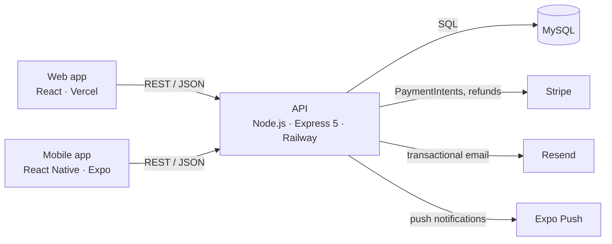

# KinoPlex API

[](https://github.com/Horvatium/cinema-api/actions/workflows/ci.yml)

REST API for **KinoPlex**, a cinema ticket booking system: browsing the programme, picking
seats on a seat map, paying online with Stripe and managing the cinema as an admin. It serves
a React web app and a React Native mobile app. Built as my bachelor's thesis project and running
in production.

**Live site:** [kinoplex.si](https://www.kinoplex.si) ·
**Web app:** [cinema-web](https://github.com/Horvatium/cinema-web) ·
**Mobile app:** [cinema-mobile](https://github.com/Horvatium/cinema-mobile) ·
[Slovenska različica](README.sl.md)


## Highlights

- **Payments with seat holds.** Starting a payment holds the seats for 10 minutes as a
  `pending` reservation, a Stripe PaymentIntent is created, and the reservation is confirmed
  only after the server verifies the payment with Stripe. If the seats were lost in the
  meantime, the payment is refunded automatically.
- **No double booking under concurrency.** Found with a test that fires parallel requests
  for the same seat, then fixed with row locking. See [below](#the-double-booking-bug).
- **Integration tests against real MySQL**, not mocks: 29 Jest + Supertest tests, run in CI
  against a MySQL 8.4 service container.
- **One-command local setup** with Docker Compose, including a seeded database.
- **CI/CD** with GitHub Actions: lint, tests, Docker build and a smoke test on every push;
  Railway deploys only after CI passes.

## Architecture



Authentication uses JWTs signed by the API; admin-only routes check the role stored in the
token. Database access goes through a `mysql2` connection pool, and multi-step writes
(reservations, payments, creating a room with its seats) run in transactions on a dedicated
connection.

Diagrams from the thesis (in Slovenian): [ER model](docs/diagrami/EER.jpg),
[use cases](docs/diagrami/use_case_diagram.jpg),
[architecture](docs/diagrami/arhitektura_sistema_drawio.jpg),
[production deployment](docs/diagrami/Arhitektura_produkcijske_namestitve_sistema.jpg).

## The double-booking bug

Booking a seat used to be a check-then-insert inside a transaction:

```sql
SELECT ... FROM reservation_seats JOIN reservations ...   -- is the seat free?
INSERT INTO reservations ...                              -- yes, book it
```

A transaction alone does not prevent a race here. Two requests arriving at the same moment
both run the `SELECT`, both see the seat as free, and both insert a reservation. The
concurrency test fires 8 parallel requests for one seat, and **all 8 succeeded**
([test commit](https://github.com/Horvatium/cinema-api/commit/5fa931c)).

**Fix** ([commit](https://github.com/Horvatium/cinema-api/commit/058713e)): every path that
takes seats (`POST /reservations`, `POST /payments/create-intent`, `POST /payments/confirm`)
now starts its transaction with `SELECT ... FROM screenings WHERE id = ? FOR UPDATE`.
Bookings for the same screening run one after another, while different screenings do not
block each other. Taking the same lock first everywhere keeps the lock order consistent,
which avoids deadlocks.

**Why not a `UNIQUE (screening_id, seat_id)` constraint?** Cancelled and expired reservations
keep their seat rows, so a unique key would also block re-booking a seat after it was freed.
Making it work would require deleting seat rows on every cancel and expiry, and changing how
reservation history is stored. The lock fixes the race without that schema change.

The same round of testing found that the API accepted seats from a different room and the same
seat listed twice, which could charge a customer twice
([fix](https://github.com/Horvatium/cinema-api/commit/fea29c8)).

## Tech stack

| Area                  | Technology                                        |
| --------------------- | ------------------------------------------------- |
| Runtime and framework | Node.js 22, Express 5                             |
| Database              | MySQL 8 (`mysql2`, connection pool, transactions) |
| Auth                  | JWT (`jsonwebtoken`), bcrypt password hashing     |
| Payments              | Stripe PaymentIntents and refunds                 |
| Email and push        | Resend, Expo push notifications                   |
| Testing               | Jest, Supertest, real MySQL database              |
| Tooling               | ESLint (flat config), Prettier                    |
| Infrastructure        | Docker, Docker Compose, GitHub Actions, Railway   |

## Getting started

### With Docker (recommended)

Requires [Docker](https://docs.docker.com/get-docker/).

```bash
git clone https://github.com/Horvatium/cinema-api.git
cd cinema-api
docker compose up --build
```

The API runs on <http://localhost:5000>, and MySQL is created from [`schema.sql`](schema.sql)
and filled with demo data from [`seed.sql`](seed.sql) on the first start.

To also run the web app, clone [cinema-web](https://github.com/Horvatium/cinema-web) next to
this repository and start the `web` profile. The site is then on <http://localhost:3000>.

```bash
docker compose --profile web up --build
```

Screenings in the seed are generated for the week after the first start. Run
`docker compose down -v` to reset the database with fresh dates.

Payments need Stripe **test** keys. Export `STRIPE_SECRET_KEY` and `STRIPE_PUBLISHABLE_KEY`
before `docker compose up`. Everything else works without them.

### Demo accounts

These accounts exist only in the local seed database, not in production.

| Role     | Email                 | Password    |
| -------- | --------------------- | ----------- |
| Admin    | `admin@kinoplex.test` | `Admin123!` |
| Customer | `demo@kinoplex.test`  | `Demo123!`  |

### Without Docker

Requires Node.js 22 and MySQL 8.

```bash
npm install
cp .env.example .env        # then fill in your database and keys
mysql -u root -p -e "CREATE DATABASE cinema"
mysql -u root -p cinema < schema.sql
mysql -u root -p cinema < seed.sql
npm run dev
```

All environment variables are documented in [`.env.example`](.env.example).

## Tests

The tests run against a real MySQL database called `cinema_test`, which is recreated on every
run. Stripe, email and push notifications are stubbed.

```bash
docker compose up -d db    # MySQL on localhost:3307
npm test
```

The test setup overrides all database settings and refuses to run against a database whose
name does not end in `_test`, so a local `.env` can never point the tests at production.
To use another server, set `TEST_DB_HOST`, `TEST_DB_PORT`, `TEST_DB_USER`, `TEST_DB_PASSWORD`
and `TEST_DB_NAME`.

| Suite                  | Covers                                                      |
| ---------------------- | ----------------------------------------------------------- |
| `auth.test.js`         | login, wrong credentials, JWT middleware                    |
| `screenings.test.js`   | programme listing, seat availability                        |
| `reservations.test.js` | booking, conflicts, invalid seats, cancelling, admin access |
| `payments.test.js`     | seat holds, invalid seats, past screenings, payment confirm |
| `concurrency.test.js`  | parallel requests for the same seat                         |

Other scripts: `npm run lint`, `npm run format`, `npm run format:check`.

## API overview

All routes are prefixed with `/api`. 🔒 needs a JWT (`Authorization: Bearer <token>`),
👑 needs the admin role.

| Method            | Route                            | Description                                                    |
| ----------------- | -------------------------------- | -------------------------------------------------------------- |
| POST              | `/auth/register`                 | Register; sends a verification email                           |
| GET               | `/auth/verify/:token`            | Verify an email address                                        |
| POST              | `/auth/resend-verification`      | Resend the verification email                                  |
| POST              | `/auth/login`                    | Log in, returns a JWT                                          |
| GET               | `/films`, `/films/:id`           | List films, film details                                       |
| POST, PUT, DELETE | `/films`, `/films/:id`           | Manage films 👑                                                |
| GET               | `/screenings`                    | Upcoming screenings with film and room details                 |
| GET               | `/screenings/:id/seats`          | Seat map with availability                                     |
| POST, PUT, DELETE | `/screenings`, `/screenings/:id` | Manage screenings (overlap check per room) 👑                  |
| GET               | `/rooms`                         | List rooms                                                     |
| POST, PUT, DELETE | `/rooms`, `/rooms/:id`           | Manage rooms; seats are generated automatically 👑             |
| POST              | `/payments/create-intent`        | Hold seats for 10 minutes and create a Stripe PaymentIntent 🔒 |
| POST              | `/payments/confirm`              | Verify the payment with Stripe and confirm the reservation 🔒  |
| POST              | `/payments/cancel-intent`        | Release held seats 🔒                                          |
| POST              | `/reservations`                  | Book without payment (used by the mobile app) 🔒               |
| GET               | `/reservations/my`               | The user's reservations 🔒                                     |
| PUT               | `/reservations/:id/cancel`       | Cancel a reservation 🔒                                        |
| GET               | `/reservations`                  | All reservations 👑                                            |
| POST              | `/upload/poster`                 | Upload a film poster 👑                                        |
| GET, DELETE       | `/users`, `/users/:id`           | Manage users 👑                                                |
| POST              | `/notifications/token`           | Save an Expo push token 🔒                                     |

## Project structure

```
├── server.js              starts the HTTP server
├── src/
│   ├── app.js             Express app: middleware and routes
│   ├── db.js              MySQL connection pool
│   ├── seats.js           seat validation shared by booking routes
│   ├── email.js           email templates and sending (Resend)
│   ├── push.js            Expo push notifications
│   ├── middleware/auth.js JWT verification
│   └── routes/            one router per resource
├── tests/                 Jest + Supertest integration tests
├── schema.sql, seed.sql   database schema and demo data
├── Dockerfile, docker-compose.yml
└── .github/workflows/     CI pipeline
```

## CI/CD

Every push and pull request runs [the CI workflow](.github/workflows/ci.yml):

1. **Lint and format:** ESLint and a Prettier check.
2. **Tests:** the full test suite against a MySQL 8.4 service container.
3. **Docker:** builds the image, starts the API and database with Docker Compose, and logs in
   with the seeded demo account as a smoke test.

Railway is set to wait for CI, so a commit reaches production only after all checks pass.

## Author

**Vid Gudič** · bachelor's thesis, CPU, 2026
